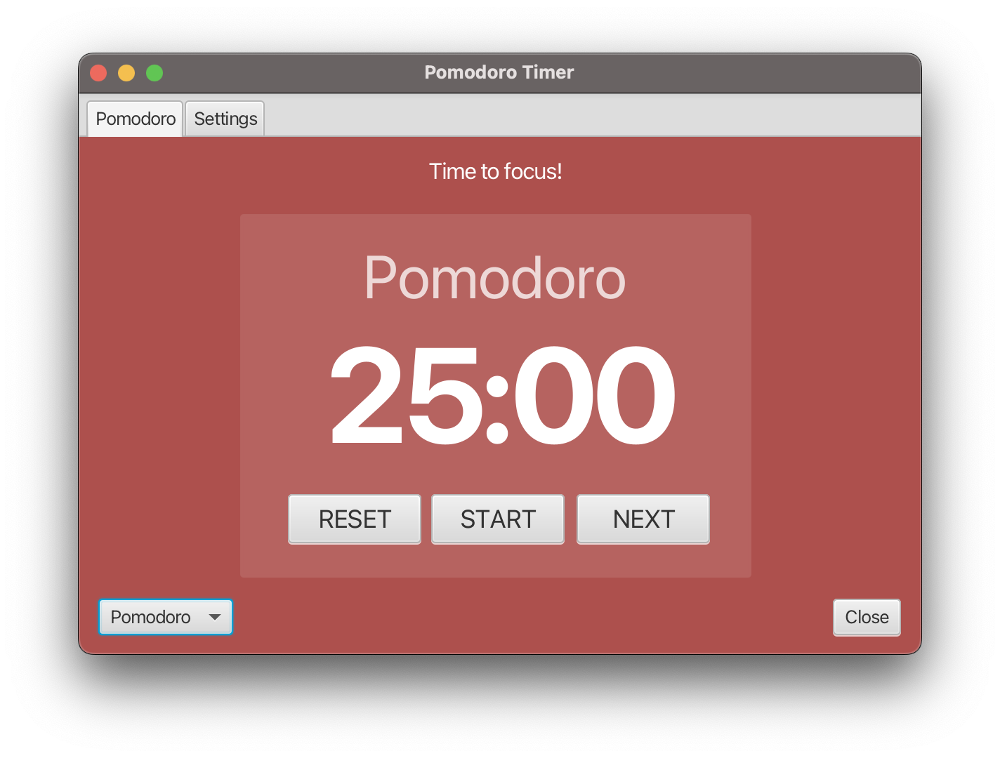
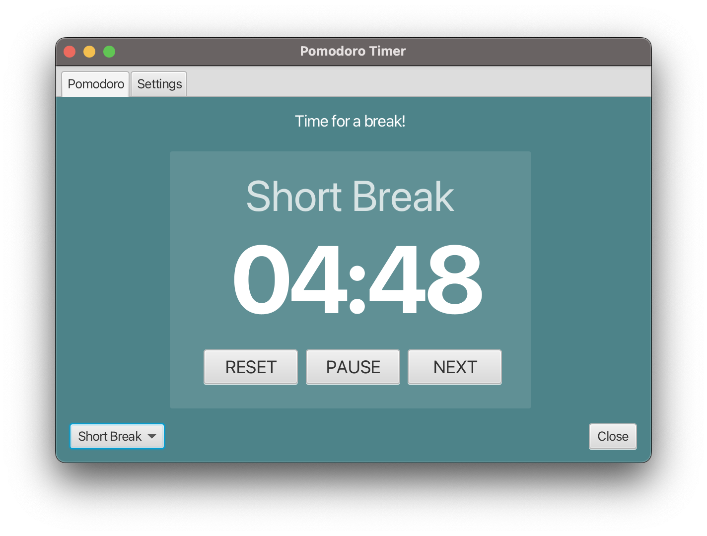
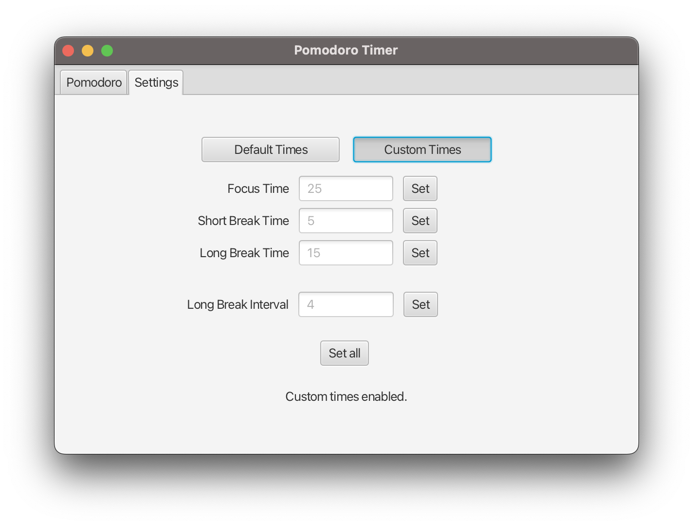

# Pomodoro Timer App

This is a simple Pomodoro timer application developed using JavaFX. The Pomodoro Technique is a time management method that uses a timer to break work into intervals, traditionally 25 minutes in length, separated by short breaks. This technique aims to improve productivity and focus by allowing for regular rest periods.

## Features

- **Pomodoro Mode:** Set a timer for your focused work sessions.
- **Short Break Mode:** Take short breaks between work sessions.
- **Long Break Mode:** Longer breaks after a certain number of work sessions.
- **Customizable Times:** Set custom durations for focus sessions, short breaks, long breaks, and intervals.
- **Sound Notification:** Receive a notification sound when a session ends.

## Usage

1. Launch the application.
2. Choose the mode (Pomodoro, Short Break, Long Break) from the dropdown menu.
3. Click the **Start** button to begin the timer.
4. Click the **Pause** button to pause the timer.
5. Click the **Resume** button to resume a paused timer.
6. Click the **Reset** button to reset the timer.
7. Click the **Next** button to move to the next session manually.

## Customization

The Pomodoro Timer App allows for extensive customization of timer durations to suit your specific needs. You can tailor the durations for focus sessions, short breaks, long breaks, and intervals between breaks.

### Customizing Timer Durations

1. **Select Custom Mode:** Toggle the **Custom Times** button under the **Settings** tab to enable custom mode.
2. **Enter Durations:** In the Settings tab, enter your desired durations in minutes for each session type:
   - **Focus Time:** The duration of your focused work sessions. This is typically set to 25 minutes in the traditional Pomodoro Technique but can be adjusted based on your preference.
   - **Short Break Time:** The duration of short breaks taken between work sessions. This is often set to 5 minutes but can be adjusted to accommodate your workflow.
   - **Long Break Time:** The duration of longer breaks taken after a certain number of work sessions. By default, this is set to 15 minutes, but you can modify it as needed.
   - **Interval:** The number of focus sessions before a long break. For example, if you set the interval to 4, you'll take a long break after completing 4 focus sessions.
3. **Apply Changes:** Once you've entered your desired durations, click the **Set All** button to apply the changes.

## Screenshots

## Installation

To use the Pomodoro Timer App, follow these steps:

1. Clone the repository: `git clone https://github.com/rafiul-arefeen/pomodor-timer-javafx.git`
2. Open the project in your Java IDE.
3. Build and run the project.
